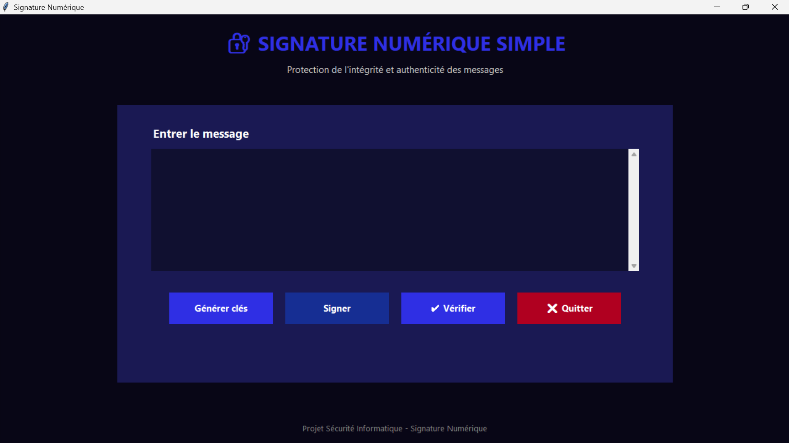
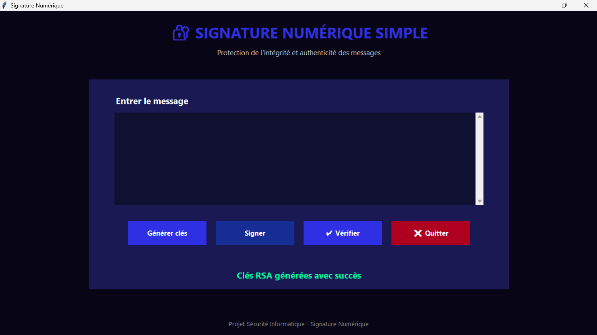
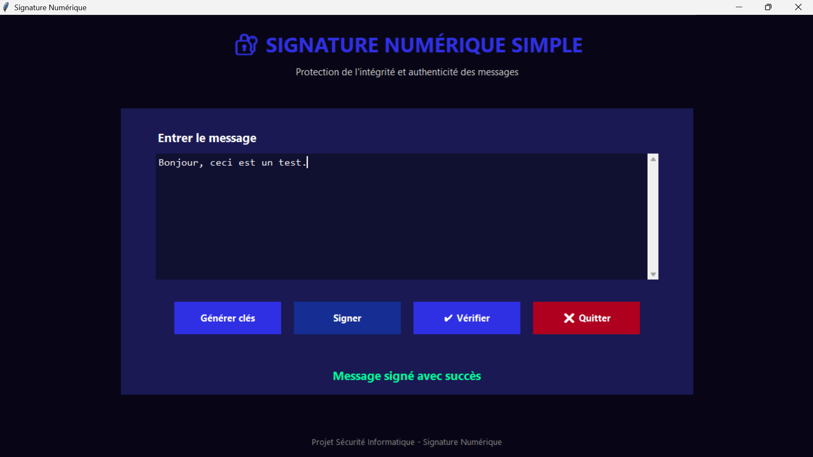
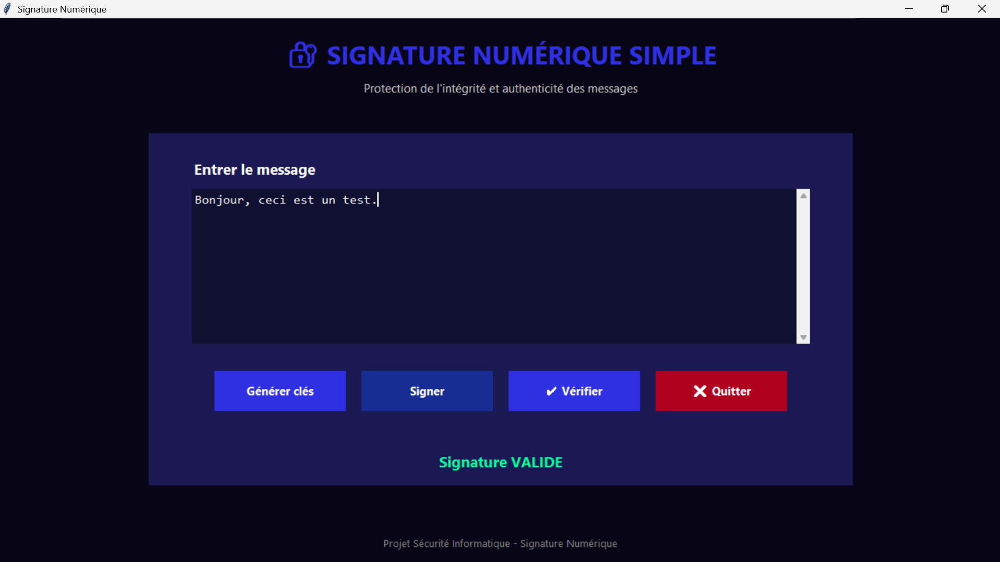
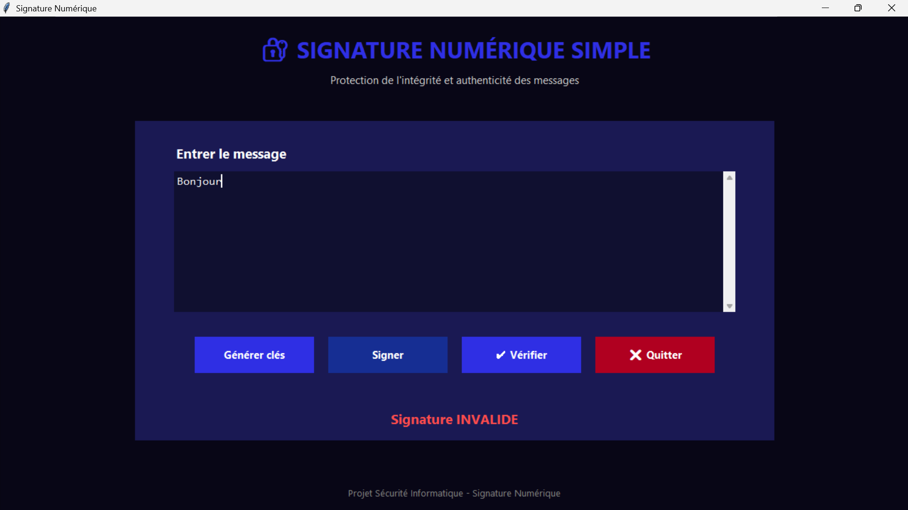

# 🔐 Signature Numérique

Projet réalisé en binôme dans le cadre du module de Sécurité Informatique.

## 👥 Auteurs

◆◇◈ [Safaa Mounkid](https://github.com/SafaaM1234)

◆◇◈ [Marwa Maqsousi](https://github.com/Marwa-Maqsoudi)

---


## 📌 Description

Cette application desktop, développée en Python, permet de démontrer le fonctionnement d'une signature numérique basée sur RSA.

**L'application permet de :**

- Générer une paire de clés RSA
- Signer un message
- Vérifier une signature numérique
- Détecter la modification d'un message

L'objectif du projet est de comprendre les principes de base de la cryptographie asymétrique et de la signature numérique.

---

## 🛠️ Technologies

- Python
- Tkinter
- cryptography
- RSA 2048 bits
- RSA-PSS
- SHA-256

---

##  📂 Structure du projet
- `Projet_Signature/` → Dossier principal du code
  - `.gitignore` → Fichiers exclus du suivi Git
  - `README.md` → Documentation du projet
  - `requirements.txt` → Dépendances Python
  - `signature_numerique.py` → Application principale
- `rapport_Signature_Numerique.pdf` → Rapport détaillé du projet
- `images/` → Captures d’écran de l’application

---
## ⚙️ Installation
**1. Cloner le repository :**
   ```bash
   git clone https://github.com/SafaaMarwaProjects/Signature-Numerique.git
   cd Signature-Numerique/Projet_Signature
   ```
**2. Installer les dépendances :**
```bash
pip install -r requirements.txt
```
---

## ▶️ Utilisation
**Lancer l’application :**
```bash
python signature_numerique.py
   ```

**Interface graphique** :

● Générer clés → Crée une paire de clés RSA (privée/publique)

● Signer → Génère une signature numérique pour le message saisi

● ✔️ Vérifier → Vérifie la validité de la signature

● ❌ Quitter → Ferme l’application

---

## 📸 Aperçu
### ▣ Fenêtre principale 


### ▣ Clés générées


### ▣ Message signé


### ▣ Signature valide


### ▣ Signature invalide


---
📖 Licence
Projet académique dans le cadre du cours de Sécurité Informatique.
Usage libre à des fins pédagogiques.
